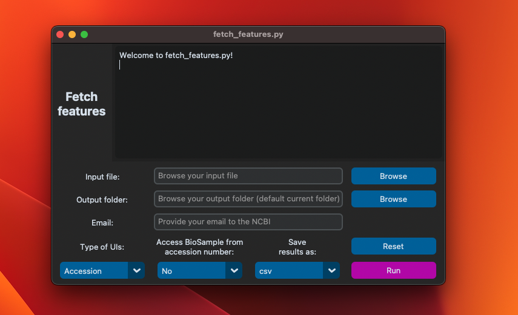

# fetch_features.py

Fetch information from a list of GenBank unique identifiers (UIDs).

The list of UIDs can be accession or BioSample numbers, and the user can
provide the UIDs in a .txt or .xlsx file.

The program first reads the list. Then, it visits the nuccore database and
collects each UID's features. The information fetched includes description,
size, topology, organism, references, etc. To check the complete list of
features the program fetches, look at the results.xlsx example.

When accessing BioSample numbers, the program removes redundant information
such as outdated accession numbers or short contigs of few nucleotides.

The program can be run in the command line or as a GUI.

## Requirements

- macOS: currently this program has been tested only in macOS but should work
  in windows
- [python](https://www.python.org/) 3.11 or later
- [Biopython](https://biopython.org/) 1.81 or later
- [customtkinter](https://customtkinter.tomschimansky.com/) 5.1 or later

## Installation

### Clone fetch_features from github

In the terminal, move to a directory where you want to clone the fetch features
project. For example:

```bash
cd ~/Documents
git clone https://github.com/ivanmugu/fetch_features.git
cd fetch_features
```

### Make a conda environment

```bash
conda create --name fetch_features
```

### Activate the environment

```bash
conda activate fetch_features
```

### Install dependencies

Install biopython via conda.

```bash
conda install -c conda-forge biopython
```

If the previous command fails, visit the following link for alternatives:
https://anaconda.org/conda-forge/biopython

Install customtkinter via pip

```bash
pip install customtkinter
```

## Usage and options

To view all the options run:

```bash
python3 fetch_features.py --help
```

Output:

```
usage: fetch_features.py [-i INPUT] [-t TYPE] [-e EMAIL] [-h] [-o OUTPUT] [-s SAVE_AS]
                         [--access-biosample-from-accession] [--gui]

Fetch features of unique identifiers (UIDs) from GenBank.

Required arguments:
  -i INPUT, --input INPUT
                        Path to input file with list of unique idenfiers.
  -t TYPE, --type TYPE  Type of unique identifier. Enter `accession` or `biosample`.
  -e EMAIL, --email EMAIL
                        Provide your email address to NCBI.

Optional arguments:
  -h, --help            Show this help message and exit.
  -o OUTPUT, --output OUTPUT
                        Path to output folder. If this flag is not provided, the
                        result files will be saved in the current directory.
  -s SAVE_AS, --save-as SAVE_AS
                        Save results as csv, excel or both (default `csv`). Enter
                        `csv`, `excel`, or `csv-excel`.
  --access-biosample-from-accession
                        If you provide a list of accession numbers, get features
                        of all related accession numbers that belong to the same
                        BioSample.
  --gui                 Activate the graphical user interface.
```

Before running the program you need a folder with all the relevant information.
For example:

```
        Documents
        +-- Results
            +-- fetch_features.py
            +-- database.py
            +-- user_input.py
            +-- list.txt    <- List with the UIDs
```

Next, you run the code as follows:

```bash
python3 fetch_features.py -i list.txt -t accession -e your@email.com
```

If you prefer to use the graphical user interface (GUI), run the following
command:

```bash
python3 fetch_features.py --gui
```

<p align="center">
  <picture>
    
  </picture>
</p>
